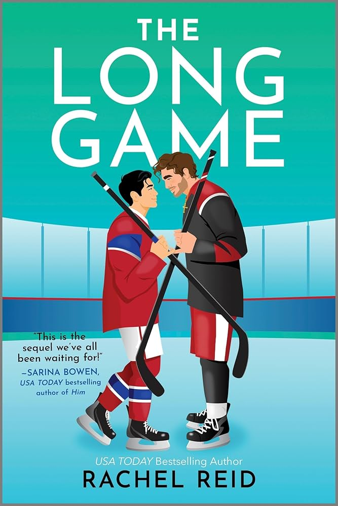
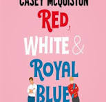

<!-- Hero Section with Animation -->

    

        📚
        📖
        📕
        📗
    

    
    <h1 class="gradient-text" style="font-size: 2.5rem; font-weight: 800; margin-bottom: 15px; position: relative; z-index: 1;">
        🏳️‍🌈 Chào mừng đến với Góc Truyện Của Tui
    </h1>
    
    

        Đây là cái ổ nhỏ tui lập ra để lưu trữ mấy bộ đam mỹ, boylove mà tui tâm đắc. Web nhà làm, bao mượt, không quảng cáo, đọc sướng con mắt.
    

    
    

        

            0
            Truyện
        

        

            0
            Chương
        

        

            0
            Lượt đọc
        

    

    
    

        <a href="#danh-sach-truyen" class="cta-btn primary">📚 Khám phá ngay</a>
        <a href="./tags/#dang-ra" class="cta-btn secondary">🔥 Truyện mới</a>
    

    <h2 style="margin: 0; color: #333; font-weight: 700;">📚 Danh sách truyện đang lên sóng</h2>
    

    <a href="./truyen/boyfriend-material/" class="book-card">
        
Đang ra

        
        

            <h3 class="card-title" style="color: #e74c3c;">Boyfriend Material</h3>
            
Tác giả: Alexis Hall

            

                [Hài Hước] Luc (con trai một huyền thoại rock) cần tuyển gấp bạn trai giả để cứu vãn hình tượng nát bét. Đối tượng: Oliver - luật sư, ăn chay, hoàn hảo đến mức đáng ghét.
            

            Hài hước, Fake Dating, Oan gia
        

    </a>

    <a href="./truyen/the-wolf-at-the-door/" class="book-card">
        
Đang ra

        
        

            <h3 class="card-title">The Wolf at the Door (Sói Nơi Ngưỡng Cửa)</h3>
            
Tác giả: Charlie Adhara

            

                Cooper Dayton ghét người sói. Oliver Park lại là một con sói quyến rũ chết người. Chuyện gì xảy ra khi cả hai bị buộc vào chung một vụ án?
            

            Trinh thám, Hành động, Oan gia ngõ hẹp
        

    </a>

    <a href="./truyen/the-foxhole-court/" class="book-card">
        
Đang ra

        
        

            <h3 class="card-title">The Foxhole Court (Sân Vận Động Hang Cáo)</h3>
            
Tác giả: Nora Sakavic

            

                Exy không phải là trò chơi, nó là chiến trường đẫm máu. Neil Josten - kẻ chạy trốn, đụng độ Andrew Minyard - thủ môn điên loạn.
            

            Sport (Exy), Tâm lý, Dark, Action
        

    </a>

    <a href="./truyen/the-long-game/" class="book-card">
        
Đang ra

        
        

            <h3 class="card-title">The Long Game (Ván Đấu Dài Hơi)</h3>
            
Tác giả: Rachel Reid

            

                Shane Hollander và Ilya Rozanov: Hai ngôi sao khúc côn cầu, mười năm đối đầu kịch liệt trên sân băng, nhưng lại yêu nhau điên cuồng trong bóng tối.
            

            Sport (Hockey), Rivals to Lovers
        

    </a>

    

        <h2 style="margin: 0; color: #27ae60; font-weight: 700;">✅ Truyện Đã Hoàn Thành</h2>
        

    

    

        <a href="./truyen/red-white-and-royal-blue/" class="book-card">
            
Hoàn thành

            
            

                <h3 class="card-title" style="color: #27ae60;">Red, White & Royal Blue</h3>
                
Tác giả: Casey McQuiston

                

                    Chuyện tình "oan gia" chấn động địa cầu giữa Alex - con trai Tổng thống Mỹ và Henry - Hoàng tử nước Anh. Từ giả vờ thân thiết đến yêu nhau quên lối về.
                

                Rom-Com, Hoàng gia, Enemies to lovers
            

        </a>
    

    

        <h2 style="margin: 0; color: #5d4037; font-weight: 700;">🚧 Dự án sắp tới</h2>
        

    

    
    

        <a href="./truyen/in-memoriam/" class="book-card" style="opacity: 0.9; border: 1px dashed #5d4037;">
            
COMING SOON

            
            

                <h3 class="card-title" style="color: #5d4037;">In Memoriam</h3>
                
Tác giả: Alice Winn

                

                    (Khúc Tưởng Niệm) Chuyện tình bi tráng giữa Gaunt và Ellwood từ trường nội trú yên bình đến địa ngục chiến hào Thế chiến thứ nhất.
                

                Lịch sử, Chiến tranh, Bi kịch
            

        </a>

        <a href="./truyen/swimming-in-the-dark/" class="book-card" style="opacity: 0.9; border: 1px dashed #2c3e50;">
            
COMING SOON

            
            

                <h3 class="card-title" style="color: #2c3e50;">Swimming in the Dark</h3>
                
Tác giả: Tomasz Jedrowski

                

                    (Dòng Chảy Ngược Chiều) Bản tình ca buồn của Đông Âu những năm 80. Ludwik và Janusz yêu nhau giữa dòng xoáy của thể chế và lý tưởng.
                

                Lịch sử, Chính trị, Day dứt
            

        </a>

        <a href="./truyen/to-catch-a-firefly/" class="book-card" style="opacity: 0.9; border: 1px dashed #f39c12;">
            
COMING SOON

            
            

                <h3 class="card-title" style="color: #f39c12;">To Catch a Firefly</h3>
                
Tác giả: Emmy Sanders

                

                    (Bắt Lấy Đom Đóm) 12 năm yêu thầm. Lucky là gió, Ellis là người giữ lửa. Một câu chuyện đẹp đến nao lòng về sự hy sinh và lòng kiên nhẫn.
                

                Friends-to-Lovers, Yêu thầm
            

        </a>

        <a href="./truyen/cut-and-run/" class="book-card" style="opacity: 0.9; border: 1px dashed #1f2f5c;">
            
COMING SOON

            
            

                <h3 class="card-title" style="color: #1f2f5c;">Cut & Run</h3>
                
Tác giả: Abigail Roux

                

                    (Đặc Vụ Oan Gia) Ty Grady (lầy lội) và Zane Garrett (khó ở) phải hợp tác bắt tội phạm giết người hàng loạt. Hành động kịch tính và chemistry bùng nổ.
                

                Hành động, Trinh thám, Oan gia
            

        </a>

    

Web này chạy bằng cơm và sự đam mê của TrieuLM.
