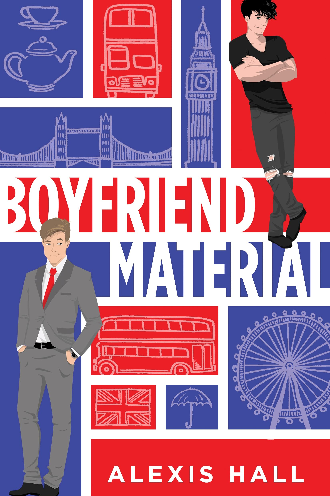

  <a href="{{ site.baseurl }}/" style="text-decoration:none; color:#888;">Home</a> / 
  <a href="{{ site.baseurl }}/tags/#dang-ra" style="text-decoration:none; color:#888;">Truyện Đang Ra</a> / 
  Chi tiết sách

    

        
        
        <a href="./chap-01" class="read-now-btn">📖 Đọc Ngay</a>
    

    

        <h1 class="epub-title">Boyfriend Material</h1>
        
        

            by <strong>Alexis Hall</strong> • Trạng thái: Đã Hoàn Thành
        

        

            ★★★★★ (4.8/5 - Cười nội thương)
        

        

            <strong>[HOT] TUYỂN GẤP BẠN TRAI HÀNG "FAKE": YÊU CẦU SẠCH SẼ, KHÔNG BỊ KHÙNG (VÌ TUI ĐỦ KHÙNG RỒI)</strong> 🚮✨
              
            Bạn sẽ làm gì khi bạn là con trai của một huyền thoại nhạc Rock, nhưng tài năng duy nhất của bạn là... làm trò cười cho thiên hạ và lên báo vì ngã sấp mặt vào thùng rác?
              
            Chào mừng đến với cuộc đời "xu cà na" của <strong>Luc O'Donnell</strong>!
        

    

    <button class="tab-btn active" onclick="openTab('details', this)">Giới Thiệu</button>
    <button class="tab-btn" onclick="openTab('toc', this)">Mục Lục (Full 26 Chương)</button>

    

        
Để cứu vãn hình tượng nát bét của mình (và giữ được công việc tại quỹ từ thiện bọ hung - đừng hỏi), Luc cần một anh bạn trai tử tế, bình thường và sạch sẽ để "làm màu". Và định mệnh đã ném vào mặt cậu <strong>Oliver Blackwood</strong>.

        
        <blockquote style="border-left: 4px solid #e74c3c; padding-left: 15px; color: #555; background: #fff5f5; padding: 10px; margin: 20px 0;">
            
<strong>🥗 Oliver:</strong> Luật sư, ăn chay trường, nếp sống kỷ luật như quân đội. Một "Cờ Xanh" chói lòa.

            
<strong>🗑️ Luc:</strong> Mặc đồ vintage, ăn uống lộn xộn, hay lo âu và mỏ hỗn. Một "Cờ Đỏ" di động.

        </blockquote>

        
Họ ghét nhau từ cái nhìn đầu tiên. Họ không có điểm chung nào ngoại trừ việc đều là gay và đều cần một người đi cùng đến mấy bữa tiệc gia đình "sượng trân".

        
        
Một bản hợp đồng <strong>Fake Dating (Hẹn hò giả)</strong> được ký kết. Nhưng mà... sao cái tên luật sư khó tính này lại biết cách dỗ dành Luc? Sao cái tên luộm thuộm này lại làm Oliver cười?

        
<em>Cảnh báo: Truyện có yếu tố hài hước kiểu Anh, châm biếm và cực kỳ dễ thương.</em>

    

    <h3 style="margin-top: 0;">Danh sách chương</h3>
    <ul style="list-style: none; padding: 0;">
        <li style="padding: 10px; border-bottom: 1px solid #eee;">
            <a href="./chap-01" style="text-decoration: none; color: #333; font-weight: bold; display: block;">
                Chương 1: Bữa Tiệc Hóa Trang & Sự Cố Rãnh Nước
            </a>
        </li>
        <li style="padding: 10px; border-bottom: 1px solid #eee;">
            <a href="./chap-02" style="text-decoration: none; color: #333; font-weight: bold; display: block;">
                Chương 2: Rắc Rối Ở Sở Làm & Kế Hoạch Hẹn Hò Giả
            </a>
        </li>
        <li style="padding: 10px; border-bottom: 1px solid #eee;">
            <a href="./chap-03" style="text-decoration: none; color: #333; font-weight: bold; display: block;">
                Chương 3: Hội Nghị Bàn Tròn & Buổi Hẹn Đầu Tiên
            </a>
        </li>
        <li style="padding: 10px; border-bottom: 1px solid #eee;">
            <a href="./chap-04" style="text-decoration: none; color: #333; font-weight: bold; display: block;">
                Chương 4: Luật Sư Biện Hộ & Hợp Đồng Hẹn Hò
            </a>
        </li>
        <li style="padding: 10px; border-bottom: 1px solid #eee;">
            <a href="./chap-05" style="text-decoration: none; color: #333; font-weight: bold; display: block;">
                Chương 5: Câu Chuyện Cười Nhạt Nhẽo & Cuộc Gặp Gỡ Bất Ngờ
            </a>
        </li>

        <li style="padding: 10px; border-bottom: 1px solid #eee;">
            <a href="./chap-06" style="text-decoration: none; color: #333; font-weight: bold; display: block;">
                Chương 6: Lời Thú Nhận & Bữa Tối Tại Nhà Oliver
            </a>
        </li>
        <li style="padding: 10px; border-bottom: 1px solid #eee;">
            <a href="./chap-07" style="text-decoration: none; color: #333; font-weight: bold; display: block;">
                Chương 7: Luật Lệ Mới & Đêm Ngủ Chung Đầu Tiên
            </a>
        </li>
        
        <li style="padding: 10px; border-bottom: 1px solid #eee;">
            <a href="./chap-15" style="text-decoration: none; color: #333; font-weight: bold; display: block;">
                Chương 15: Cuộc Gặp Gỡ Với Người Bố Huyền Thoại
            </a>
        </li>
        <li style="padding: 10px; border-bottom: 1px solid #eee;">
            <a href="./chap-16" style="text-decoration: none; color: #333; font-weight: bold; display: block;">
                Chương 16: Khủng Hoảng Phòng Tắm & Màn Làm Lành Dưới Mưa
            </a>
        </li>
        <li style="padding: 10px; border-bottom: 1px solid #eee;">
            <a href="./chap-17" style="text-decoration: none; color: #333; font-weight: bold; display: block;">
                Chương 17: Thú Nhận Trong Đêm & Lời Hứa Của Oliver
            </a>
        </li>
        <li style="padding: 10px; border-bottom: 1px solid #eee;">
            <a href="./chap-18" style="text-decoration: none; color: #333; font-weight: bold; display: block;">
                Chương 18: Triển Lãm Nghệ Thuật & Cuộc Gọi Từ Bố
            </a>
        </li>
        <li style="padding: 10px; border-bottom: 1px solid #eee;">
            <a href="./chap-19" style="text-decoration: none; color: #333; font-weight: bold; display: block;">
                Chương 19: Bữa Tiệc Sinh Nhật Hỗn Loạn & Đêm Đầu Tiên
            </a>
        </li>
        <li style="padding: 10px; border-bottom: 1px solid #eee;">
            <a href="./chap-20" style="text-decoration: none; color: #333; font-weight: bold; display: block;">
                Chương 20: Buổi Sáng Sau Đêm Ấy & Cuộc Gọi Từ Jon Fleming
            </a>
        </li>

        <li style="padding: 10px; border-bottom: 1px solid #eee;">
            <a href="./chap-21" style="text-decoration: none; color: #333; font-weight: bold; display: block;">
                Chương 21: Sự Kiện Gây Quỹ & Màn Trình Diễn Của Oliver
            </a>
        </li>
        <li style="padding: 10px; border-bottom: 1px solid #eee;">
            <a href="./chap-22" style="text-decoration: none; color: #333; font-weight: bold; display: block;">
                Chương 22: Trò Đùa Cốc Cốc & Bữa Tiệc Kỷ Niệm Sóng Gió
            </a>
        </li>
        <li style="padding: 10px; border-bottom: 1px solid #eee;">
            <a href="./chap-23" style="text-decoration: none; color: #333; font-weight: bold; display: block;">
                Chương 23: Đồng Minh Bất Đắc Dĩ & Màn Bảo Vệ Oliver
            </a>
        </li>
        <li style="padding: 10px; border-bottom: 1px solid #eee;">
            <a href="./chap-24" style="text-decoration: none; color: #333; font-weight: bold; display: block;">
                Chương 24: Cuộc Cãi Vã Trên Xe & Lời Chia Tay
            </a>
        </li>
        <li style="padding: 10px; border-bottom: 1px solid #eee;">
            <a href="./chap-25" style="text-decoration: none; color: #333; font-weight: bold; display: block;">
                Chương 25: Sự Thật Về Bố & Bài Báo Của Cameron
            </a>
        </li>
        <li style="padding: 10px; border-bottom: 1px solid #eee;">
            <a href="./chap-26" style="text-decoration: none; color: #333; font-weight: bold; display: block;">
                Chương 26: Cái Kết Viên Mãn & Tình Yêu Đích Thực HOÀN
            </a>
        </li>
    </ul>

