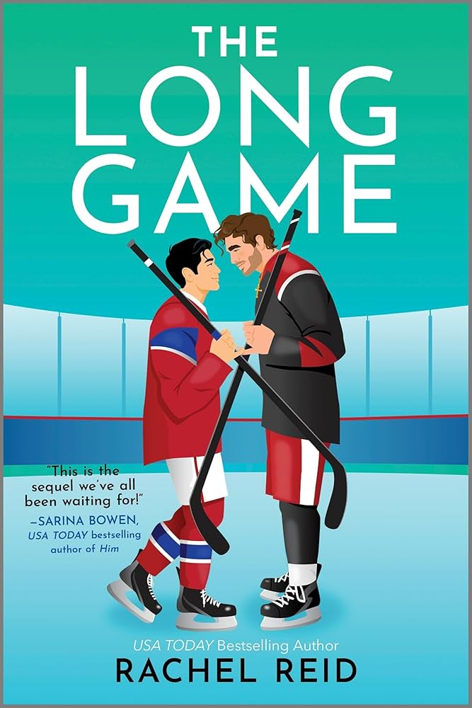

  <a href="{{ site.baseurl }}/" style="text-decoration:none; color:#888;">Home</a> / 
  <a href="{{ site.baseurl }}/tags/#sport" style="text-decoration:none; color:#888;">Sport</a> / 
  Chi tiết sách

    

        
    

    

        <h1 class="epub-title">The Long Game</h1>
        
        

            by <strong>Rachel Reid</strong> • Cập nhật: 01/12/2025
        

        

            ★★★★★ (4.9/5 - Đỉnh cao Hockey)
        

        

            <strong>Shane Hollander</strong> và <strong>Ilya Rozanov</strong>. Hai cái tên đình đám nhất làng khúc côn cầu (Hockey). Hai đối thủ không đội trời chung trên mặt băng. Truyền thông thêu dệt về sự kình địch của họ suốt một thập kỷ.
              
            Nhưng có một sự thật mà không ai biết: <strong>Họ yêu nhau.</strong>
        

    

    <button class="tab-btn active" onclick="openTab('details', this)">Giới Thiệu</button>
    <button class="tab-btn" onclick="openTab('toc', this)">Mục Lục (Đang cập nhật)</button>

    

        
Trong khi thế giới nghĩ họ ghét nhau đến tận xương tủy, thì Shane và Ilya lại bí mật chia sẻ những khoảnh khắc nóng bỏng, những nụ hôn vội vã và một tình yêu bị chôn giấu trong bóng tối.

        
        <blockquote style="border-left: 4px solid #159957; padding-left: 15px; color: #555; font-style: italic; margin: 20px 0; background: #f9f9f9; padding: 10px;">
            "MƯỜI NĂM ĐỐI ĐẦU - MỘT TÌNH YÊU BÍ MẬT"
        </blockquote>

        
Giờ đây, khi cả hai đang ở đỉnh cao sự nghiệp và danh vọng, cái giá phải trả cho bí mật này ngày càng đắt. Liệu họ có thể tiếp tục chơi "ván đấu dài hơi" (the long game) này đến bao giờ? Hay đã đến lúc bước ra ánh sáng, bất chấp mọi rủi ro?

    

    <h3 style="margin-top: 0;">Danh sách chương</h3>
    <ul style="list-style: none; padding: 0;">
        <li style="padding: 10px; border-bottom: 1px solid #eee;">
            <a href="./chap-01" style="text-decoration: none; color: #333; font-weight: bold; display: block;">
                Chương 1: Kèo Late Căng Cực Đọc ngay ➔
            </a>
        </li>
        <li style="padding: 10px; border-bottom: 1px solid #eee;">
            <a href="./chap-02" style="text-decoration: none; color: #333; font-weight: bold; display: block;">
                Chương 2: Cơn Ghen Của Gấu Nga Đọc ngay ➔
            </a>
        </li>
        <li style="padding: 10px; border-bottom: 1px solid #eee;">
            <a href="./chap-03" style="text-decoration: none; color: #333; font-weight: bold; display: block;">
                Chương 3: Khi Gay Bar Có Bán Pizza Đọc ngay ➔
            </a>
        </li>
        <li style="padding: 10px; border-bottom: 1px solid #eee;">
            <a href="./chap-04" style="text-decoration: none; color: #333; font-weight: bold; display: block;">
                Chương 4: Phòng Thay Đồ Và Những Kẻ Khờ Mộng Mơ Đọc ngay ➔
            </a>
        </li>
        <li style="padding: 10px; border-bottom: 1px solid #eee;">
            <a href="./chap-05" style="text-decoration: none; color: #333; font-weight: bold; display: block;">
                Chương 5: Đêm Của Những Kẻ Khát Cầu Đọc ngay ➔
            </a>
        </li>
        <li style="padding: 10px; border-bottom: 1px solid #eee;">
            <a href="./chap-06" style="text-decoration: none; color: #333; font-weight: bold; display: block;">
                Chương 6: Mùa Đông Đang Đến Đọc ngay ➔
            </a>
        </li>
        <li style="padding: 10px; border-bottom: 1px solid #eee;">
            <a href="./chap-07" style="text-decoration: none; color: #333; font-weight: bold; display: block;">
                Chương 7: Vương Triều Và Cái Chuồng Rỗng Đọc ngay ➔
            </a>
        </li>
        <li style="padding: 10px; border-bottom: 1px solid #eee;">
            <a href="./chap-08" style="text-decoration: none; color: #333; font-weight: bold; display: block;">
                Chương 8: Cù Lũ Và Cú Lừa Đọc ngay ➔
            </a>
        </li>
        <li style="padding: 10px; border-bottom: 1px solid #eee;">
            <a href="./chap-09" style="text-decoration: none; color: #333; font-weight: bold; display: block;">
                Chương 9: Bí Ngô Và Những Lời Xin Lỗi Phủ Đầu Đọc ngay ➔
            </a>
        </li>
        <li style="padding: 10px; border-bottom: 1px solid #eee;">
            <a href="./chap-10" style="text-decoration: none; color: #333; font-weight: bold; display: block;">
                Chương 10: Giao Diện "Hư Hỏng" Và Đôi Mắt Hình Trái Tim Đọc ngay ➔
            </a>
        </li>
        <li style="padding: 10px; border-bottom: 1px solid #eee; color: #aaa;">
            Chương 11 - End: (Đang cập nhật...) 🔒
        </li>
    </ul>

